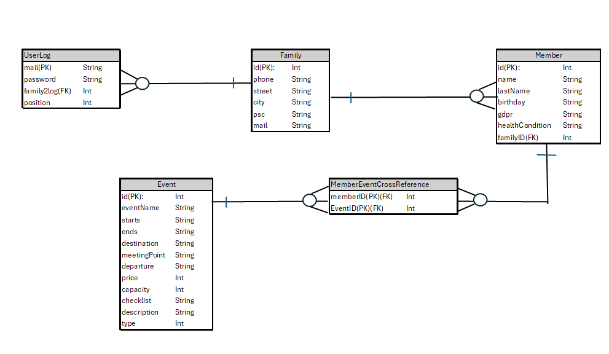

<!DOCTYPE html>
<html lang="cs">
<head>
    <meta charset="UTF-8">
    <meta name="viewport" content="width=device-width, initial-scale=1.0">
    <title>Název Aplikace</title>
</head>
<body>

<h1>TOM Litomíci Základní verze organizačního systému na mobil </h1>

<h2>Motivace</h2>

    TOM Litomíci je turistický oddíl mládeže, který se zaměřuje na rozvoj dětí a mládeže prostřednictvím outdoorových aktivit, táborů a různých dobrodružných výprav. Oddíl je známý svou dlouholetou tradicí a aktivním zapojením do komunitních akcí.Více informací o TOM Litomíci se dozvíte na jejich webových stránkách <a href="https://www.litomici.euweb.cz">zde</a>.

    V dnešní době jsou moderní trendy v oblasti systémů a technologií zaměřeny především na mobilní aplikace. Tyto aplikace umožňují uživatelům snadný přístup k informacím a službám kdykoliv a kdekoliv. Proto ani tento oddíl nemůže zůstat pozadu a tak vznikla tato aplikace. Autor této aplikace je aktivním členem oddílu TOM Litomíci a to ho motivovalo vytvořit tuto aplikaci s cílem usnadnit komunikaci a organizaci aktivit pro všechny členy oddílu. 

<h2>Technické Parametry</h2>

    Tato aplikace je vyvíjena v programovacím jazyce Kotlin za použití vývojového prostředí Android Studio. Kotlin je moderní a efektivní jazyk, který umožňuje rychlý a bezpečný vývoj aplikací pro platformu Android. Aplikace je navržena tak, aby byla uživatelsky přívětivá a snadno ovladatelná.

    Pro ukládání dat je použita SQLite databáze, která je integrována přímo do aplikace. SQLite je lehká a výkonná databáze, která umožňuje efektivní správu dat bez nutnosti externího serveru. Návrh databáze zahrnuje několik tabulek, které jsou optimalizovány pro rychlé vyhledávání a ukládání informací. Struktura databáze je navržena tak, aby podporovala všechny hlavní funkce aplikace, včetně správy uživatelů, aktivit a událostí.

    Dokumentace v kódu je pečlivě vytvořena pomocí komentářů, které poskytují dostatečné vysvětlení všech funkcí, aktivit a fragmentů aplikace. Tyto komentáře usnadňují pochopení kódu a umožňují snadnou údržbu a rozšiřování aplikace. Díky podrobné dokumentaci mohou vývojáři rychle porozumět struktuře a logice aplikace, což zjednodušuje její další vývoj a úpravy.

    Návrh databáze je klíčovým prvkem aplikace, který zajišťuje efektivní a bezpečné ukládání dat. Struktura databáze je navržena s ohledem na potřeby uživatelů a optimalizována pro rychlý přístup k informacím. Obrázek níže ilustruje základní schéma databáze, které zahrnuje hlavní tabulky a jejich vztahy.

<h2>Návod k Ovládání</h2>

<h3>1) Funkce</h3>
<ul>
    <li><strong>Rozvrh akcí oddílu:</strong> Umožňuje členům zobrazit plánované akce a události.</li>
    <li><strong>Snadný přístup k informacím:</strong> Poskytuje rychlý přístup k důležitým informacím o akcích a aktivitách.</li>
    <li><strong>Urychlení komunikace mezi členy oddílu:</strong> Zajišťuje efektivní komunikaci mezi členy a vedoucími.</li>
    <li><strong>Snadno dostupná data pro vedoucí:</strong> Vedoucí mají přístup k důležitým datům a informacím o členech a akcích.</li>
    <li><strong>Více přístupů k jednomu účtu:</strong> Každý člen rodiny může mít přístup k jednomu účtu, což usnadňuje správu účtu.</li>
    <li><strong>Možnost pro vedoucí upravovat akce:</strong> Vedoucí mohou upravovat, rušit a zakládat nové akce.</li>
</ul>

<h3>2) Ovládání</h3>

    Ovládání aplikace je jednoduché a intuitivní:

<ol>
    <li><strong>První spuštění:</strong> Po prvním spuštění aplikace se musí udělat registrace, stačí v úvodní obrazovce kliknout na zaregistrovat a vyplnit údaje.</li>
    <li><strong>Přidání členů:</strong> Po registraci mohou uživatelé přidat členy rodiny nebo oddílu do svého účtu.</li>
    <li><strong>Další přihlášení:</strong> Při dalším přihlášení se uživatelé mohou snadno orientovat pomocí navigačního menu.</li>
    <li><strong>Zápis na akce:</strong> Uživatelé se mohou zapsat na plánované akce a události prostřednictvím aplikace.</li>
    <li><strong>Účet vedoucího:</strong> Pokud je účet označen jako vedoucí, má uživatel možnost vstoupit do úprav akcí, kde může upravovat, rušit a zakládat nové akce.</li>
</ol>
<h2>Závěr</h2>

    Tato aplikace byla vytvořena s cílem usnadnit komunikaci a organizaci aktivit pro členy oddílu TOM Litomíci. Díky moderním technologiím a pečlivě navržené struktuře databáze poskytuje aplikace efektivní a uživatelsky přívětivé řešení pro správu akcí a událostí.

    Doufáme, že vám tato aplikace přinese mnoho užitku a usnadní vám plánování a účast na aktivitách oddílu. Pokud máte jakékoliv dotazy nebo návrhy na vylepšení, neváhejte nás kontaktovat. Vaše zpětná vazba je pro nás velmi cenná a pomůže nám aplikaci dále zlepšovat.

    Děkujeme za vaši podporu a přejeme vám mnoho úspěchů a radosti při používání aplikace!

</body>
</html>
